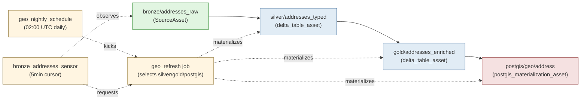

# Orchestration — index

The `socialwarehouse.orchestration` subpackage owns warehouse pipeline
orchestration: scheduled bronze→silver→gold Delta refreshes,
sensor-driven backfills, and Delta→PostGIS materialization. It runs
on **Dagster**.

It is **separate from Celery** (`socialwarehouse.celery_app`), which
owns web-app-triggered async tasks. Dagster orchestrates the
warehouse pipeline; Celery handles request-driven async work. They
coexist without overlap.

## Asset graph (demo: `geo` domain)



Each domain (civic, demographic, economic, etc.) declares its own
asset module under `socialwarehouse/orchestration/assets/<domain>.py`
following the same pattern. The geo module is the demonstration; the
others land via their own sub-issues from SW#275.

## Documentation

| Document | When to read |
|---|---|
| [README.md](README.md) (this file) | Landing here for the first time, want the overview + asset graph |
| [how-to-add-asset-to-existing-domain.md](how-to-add-asset-to-existing-domain.md) | You're adding a new asset (e.g. a new silver transformation) to a domain that already exists in SW |
| [instance-project-guide.md](instance-project-guide.md) | You're an **instance project** (UK-warehouse, EU-warehouse, etc.) forking SW and need to add your own domains or override SW's |
| [how-to-operate.md](how-to-operate.md) | You're running Dagster — local dev, debugging a failed asset, deploying to production |
| [reference.md](reference.md) | You need the env var matrix, the asset key naming convention, the factory function signatures, or troubleshooting for a specific error |

## Quick reference

```bash
# Install (optional extra)
pip install -e ".[orchestration]"

# Required env vars (set in .env)
DJANGO_SETTINGS_MODULE=socialwarehouse.settings.dev
SW_WAREHOUSE_ROOT=file:///tmp/sw-warehouse   # or s3a://your-bucket
SW_CATALOG=socialwarehouse                    # optional, default 'socialwarehouse'
SW_VINTAGE=2020                               # optional, default 2020

# Launch the Dagster UI
dagster dev -m socialwarehouse.orchestration

# Run a specific asset from the CLI
dagster asset materialize -m socialwarehouse.orchestration --select 'warehouse/silver/addresses_typed'

# Run the full geo refresh job
dagster job execute -m socialwarehouse.orchestration -j geo_refresh
```

## Source

| Module | Purpose |
|---|---|
| `socialwarehouse/orchestration/__init__.py` | Entry point, re-exports `defs` |
| `socialwarehouse/orchestration/definitions.py` | The canonical `Definitions` object Dagster discovers |
| `socialwarehouse/orchestration/resources.py` | `WarehouseConfig`, `SparkResource`, `PostGISResource` |
| `socialwarehouse/orchestration/asset_factories.py` | `delta_table_asset`, `postgis_materialization_asset` |
| `socialwarehouse/orchestration/assets/geo.py` | Demo geo asset graph |
| `socialwarehouse/orchestration/schedules.py` | `geo_nightly_schedule`, `geo_refresh_job` |
| `socialwarehouse/orchestration/sensors.py` | `bronze_addresses_sensor` |

## Tests

```bash
pytest tests/orchestration/
```

Tests skip cleanly when the `[orchestration]` extra is not installed
— the optional-extra contract is preserved for non-Dagster SW
consumers.

## Pre-author inventory discipline

Per `[rule:authoring-against-state]` rule 6 (from
`claude-configs-public`), every asset compute function change should
be preceded by a pre-author inventory posted to the relevant ticket
BEFORE the asset is modified. The factories don't enforce this; the
discipline is on the author. The orchestration layer's job is to
make the discipline mechanical once exercised — the asset keys +
factory wiring give the reviewer a clean spec to check the
implementation against.

See `how-to-add-asset-to-existing-domain.md` for the inventory
template applied to a concrete asset.
